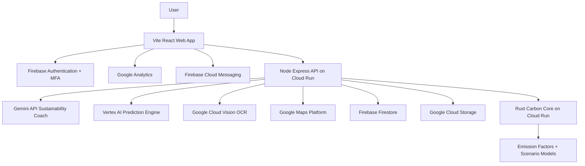
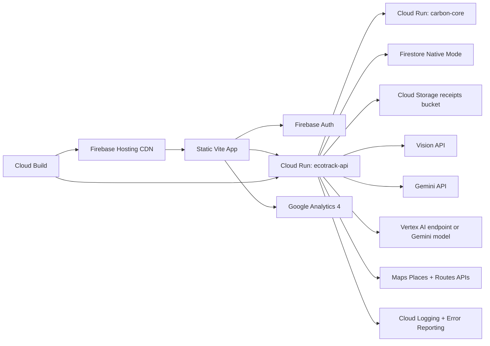
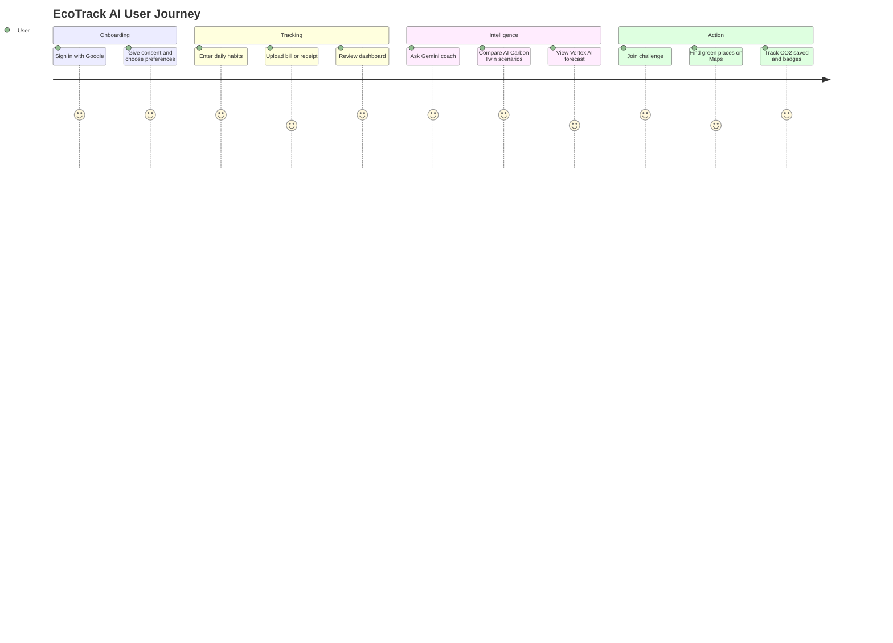

# EcoTrack AI

EcoTrack AI is a Google Cloud and Gemini powered carbon footprint awareness platform that helps individuals understand, track, predict, and reduce emissions through simple daily actions, personalized AI insights, and community challenges.

The project uses a modern hackathon-ready stack:

- Frontend: React 19, Vite, TypeScript, Tailwind CSS, ShadCN-style local UI primitives
- Backend: Node.js, Express.js, TypeScript, OpenAPI, Firebase Admin
- Carbon engine: Rust, Axum, Tokio
- AI: Gemini API and Vertex AI
- Google Cloud: Firebase Auth, Firestore, Firebase Hosting, Cloud Run, Cloud Storage, Vision API, Maps Platform, Firebase Cloud Messaging, Google Analytics
- Quality: strict TypeScript, ESLint, Prettier, Jest, React Testing Library, Cypress, Rust tests, GitHub Actions, Cloud Build

## 1. Project Overview

EcoTrack AI turns personal carbon tracking into a clear and motivating daily habit. Users can calculate emissions from transport, energy, food, and lifestyle choices, then receive Gemini-powered reduction plans, Vertex AI forecasts, OCR-based bill analysis, location-aware green suggestions, and gamified community challenges.

Core outcomes:

- Understand personal CO2e sources with clear category breakdowns.
- Track daily, weekly, monthly, and annual emissions.
- Predict future emissions and confidence ranges.
- Simulate an AI Carbon Twin across alternate lifestyles.
- Reduce impact using personalized, measurable recommendations.
- Build habits through badges, eco points, leaderboards, and challenges.
- Measure real impact as CO2 saved, trees equivalent, money saved, and sustainability score.

## 2. Problem Analysis

People often want to live more sustainably but face four barriers:

- Carbon data is abstract and difficult to connect to daily actions.
- Manual tracking is tedious and loses accuracy without receipts or bills.
- Generic tips do not adapt to lifestyle, location, or goals.
- Motivation drops when progress is invisible or isolated.

EcoTrack AI solves this by combining transparent calculations, Gemini coaching, OCR automation, forecasts, gamification, and community accountability.

## 3. Unique Selling Points

- AI Carbon Twin: simulates current habits and alternative futures before the user commits.
- Multimodal carbon tracking: manual calculator plus Vision OCR for electricity bills, fuel receipts, and shopping receipts.
- Google Cloud native architecture: Firebase, Cloud Run, Cloud Storage, Vision, Maps, Gemini, Vertex AI, FCM, and Analytics.
- Accessibility-first design: WCAG 2.2 AA target, keyboard navigation, screen reader support, voice input, text-to-speech, high contrast, dark mode, font scaling, and colorblind-safe charts.
- Secure-by-default backend: Firebase ID tokens, RBAC, validation, NoSQL sanitization, rate limiting, CSP, optional CSRF, and encrypted sensitive fields.
- Polyglot performance: Rust handles carbon calculations and simulations, Node orchestrates APIs and Google Cloud integrations, React/Vite delivers a fast UI.

## 4. Complete Architecture



## 5. Google Cloud Architecture



## 6. Database Schema

Firestore collections:

```text
users/{userId}
  displayName: string
  email: string
  role: "user" | "moderator" | "admin"
  consent: { analytics: boolean, aiPersonalization: boolean, reminders: boolean }
  preferences: { theme: string, language: string, highContrast: boolean, fontScale: number }
  createdAt: timestamp

users/{userId}/footprints/{entryId}
  userId: string
  source: "manual" | "ocr" | "import"
  transportKg: number
  energyKg: number
  foodKg: number
  lifestyleKg: number
  totalKg: number
  inputs: map
  createdAt: timestamp

users/{userId}/goals/{goalId}
  title: string
  targetKgReduction: number
  progressKg: number
  dueAt: timestamp
  status: "active" | "completed" | "paused"

challenges/{challengeId}
  ownerId: string
  title: string
  description: string
  targetKg: number
  startsAt: timestamp
  endsAt: timestamp
  visibility: "friends" | "college" | "city" | "global"

challenges/{challengeId}/participants/{userId}
  score: number
  co2SavedKg: number
  joinedAt: timestamp
  updatedAt: timestamp

communities/{communityId}
  ownerId: string
  name: string
  city: string
  memberCount: number

leaderboards/{boardId}
  scope: "friends" | "college" | "city" | "global"
  entries: array

auditLogs/{logId}
  event: string
  payload: map
  createdAt: timestamp
```

## 7. API Documentation

Swagger UI is served at:

```bash
http://localhost:8080/api/docs
```

Key endpoints:

| Method | Endpoint | Purpose |
| --- | --- | --- |
| GET | `/health` | Service health |
| POST | `/api/v1/carbon/calculate` | Carbon footprint calculation |
| POST | `/api/v1/coach/chat` | Gemini sustainability coaching |
| POST | `/api/v1/twin/simulate` | AI Carbon Twin scenarios |
| POST | `/api/v1/predictions/forecast` | Vertex AI emission forecast |
| POST | `/api/v1/ocr/analyze` | Vision OCR bill and receipt analysis |
| GET | `/api/v1/maps/places` | Nearby recycling, EV, transit, and green events |
| GET | `/api/v1/challenges` | Sustainability challenges |
| POST | `/api/v1/challenges` | Create community challenge |
| GET | `/api/v1/leaderboard` | Leaderboards |

## 8. UI/UX Design

Design principles:

- Clear climate cockpit with score, footprint, savings, and next actions.
- Warm ecological visual language using soil, leaf, sun, tide, mint, and paper tones.
- Strong typography with expressive display headings and readable UI text.
- Colorblind-safe chart palette and non-color labels.
- Progressive disclosure so new users can start with a calculator and grow into OCR, AI coaching, maps, and community.
- Motion is meaningful and respects `prefers-reduced-motion`.

## 9. User Flow



## 10. Security Plan

- Firebase Authentication with Google Sign-In and MFA support.
- Firebase Admin ID token verification on protected APIs.
- Role-based access control for user, moderator, and admin operations.
- Firestore and Storage security rules enforce ownership.
- Helmet security headers, CSP, HSTS on Firebase Hosting, and referrer policy.
- CORS allowlist, rate limiting, input validation with Zod, XSS sanitization, and NoSQL injection protection.
- Optional double-submit CSRF protection for cookie-based deployments.
- AES-256-GCM helper for sensitive field encryption.
- Audit log hooks for sensitive actions.
- Secret-free repo with `.env.example` and Cloud Secret Manager recommended for production.
- GDPR-ready consent fields, privacy preferences, export/delete design, and data minimization.

## 11. Accessibility Plan

Target: Lighthouse Accessibility 95+ and WCAG 2.2 AA.

Implemented:

- Semantic landmarks, headings, labels, and skip link.
- Keyboard-friendly controls with visible focus states.
- Screen reader friendly ARIA labels and status messaging.
- Voice input for AI coach and voice commands for navigation.
- Text-to-speech for AI coaching responses.
- High contrast mode, dark mode, adjustable font size, and language selector.
- Colorblind-safe charts and heat map.
- Reduced motion support.

## 12. Testing Plan

Testing layers:

- Unit: Rust carbon calculations, TypeScript utilities, local carbon engine.
- Component: React Testing Library for calculator and core product sections.
- Accessibility: `jest-axe` initial render audit.
- Integration: Supertest for Express routes, validation, security headers, Maps fallback, Gemini fallback.
- E2E: Cypress smoke journey across calculator and accessibility controls.
- CI/CD: GitHub Actions runs install, lint, typecheck, coverage, audit, build, and Cypress.

Coverage targets:

- 95%+ for production expansion.
- Current thresholds are lower in scaffold mode to avoid blocking early iteration while tests grow.

## 13. Deployment Plan

Local development:

```bash
npm install
npm run dev
npm run dev:api
cargo run --manifest-path services/carbon-core/Cargo.toml
```

Production deployment:

1. Create Firebase project and enable Auth, Firestore, Hosting, Storage, FCM, and Analytics.
2. Enable Google Cloud APIs: Cloud Run, Artifact Registry, Cloud Build, Vision API, Maps Platform, Vertex AI.
3. Store secrets in Secret Manager: Gemini key, Maps key, Firebase service account, field encryption key.
4. Build and deploy Cloud Run services with `cloudbuild.yaml`.
5. Deploy Vite build to Firebase Hosting with rewrites to Cloud Run API.
6. Upload Firestore indexes and security rules.
7. Monitor Cloud Logging, Error Reporting, Cloud Trace, and Analytics funnels.

## 14. Google Cloud Integration Plan

| Service | Usage |
| --- | --- |
| Gemini API | AI sustainability coach and personalized roadmaps |
| Vertex AI | Emission forecasts, confidence scores, future trend modeling |
| Firebase Authentication | Google Sign-In, MFA, secure identity |
| Firestore | Users, footprints, goals, challenges, communities, leaderboards |
| Firebase Cloud Messaging | Habit reminders and challenge notifications |
| Firebase Hosting | CDN-backed Vite frontend hosting |
| Cloud Run | Node API and Rust carbon-core services |
| Google Maps Platform | Recycling, EV charging, transit routes, tree drives, green events |
| Vision API | OCR extraction from bills and receipts |
| Cloud Storage | Secure uploads for receipts and documents |
| Google Analytics | Product analytics and sustainability behavior funnels |

## 15. Sustainability Impact Metrics

EcoTrack AI measures:

- Daily, weekly, monthly, and annual kg CO2e.
- CO2 saved compared with baseline.
- Trees equivalent using approximate annual sequestration.
- Money saved from transport and energy changes.
- Sustainability score and carbon score.
- Challenge impact per user, group, city, and global cohort.
- Forecasted future emissions and potential reduction ranges.

## 16. Future Scope

- BigQuery carbon analytics and Looker Studio dashboards for city-level insights.
- Wearable and smart meter integrations.
- Open emission factor marketplace with region-specific datasets.
- Verified carbon challenge proofs using receipt OCR and location verification.
- Personalized carbon budgets by country, household size, and climate target.
- Offline-first mobile app with on-device OCR pre-processing.
- School, college, and enterprise sustainability programs.

## Repository Structure

```text
.
  apps/web                 Vite React application
  services/api             Node.js Express API
  services/carbon-core     Rust Axum carbon engine
  docs                     Architecture, security, accessibility, testing, deployment docs
  cypress/e2e              End-to-end tests
  .github/workflows        CI pipeline
  firebase.json            Firebase Hosting, Firestore, and Storage config
  firestore.rules          Firestore security rules
  storage.rules            Cloud Storage security rules
  cloudbuild.yaml          Google Cloud Build and Cloud Run deployment
```

## Quick Start

```bash
npm install
npm run typecheck
npm run test
npm run build
```

Run web:

```bash
npm run dev
```

Run API:

```bash
npm run dev:api
```

Run Rust carbon core:

```bash
cargo run --manifest-path services/carbon-core/Cargo.toml
```
