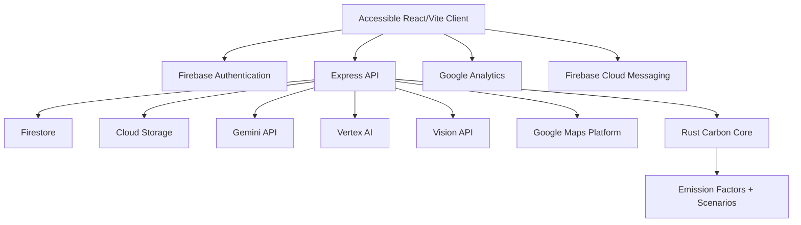
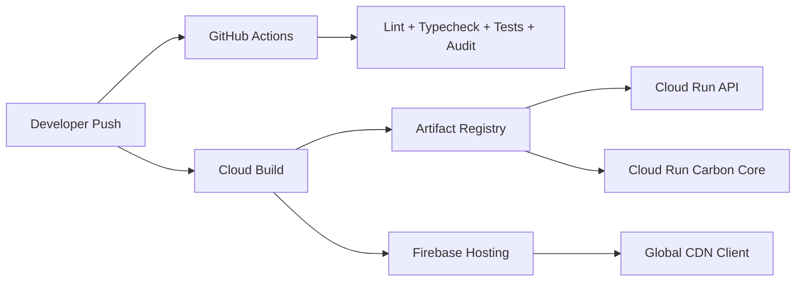

# Architecture

EcoTrack AI uses a polyglot, cloud-native architecture optimized for demo velocity and production readiness.

## System Architecture

## Deployment Architecture

## Clean Architecture Boundaries

- `apps/web`: presentation, accessibility, client state, Firebase web SDK integration.
- `services/api/src/routes`: HTTP adapters.
- `services/api/src/middleware`: security, auth, validation.
- `services/api/src/services`: business services and Google Cloud adapters.
- `services/carbon-core`: deterministic Rust calculation domain.
- `docs`: architecture and evaluation evidence.

## Efficiency Choices

- Vite code splitting separates charts, Firebase, and Maps.
- Rust service is stateless and horizontally scalable on Cloud Run.
- Express API performs credential-bound orchestration and falls back gracefully for demos.
- Firestore schema keeps user-specific data under user subcollections for efficient security rules.
- Firebase Hosting CDN serves static assets globally.
