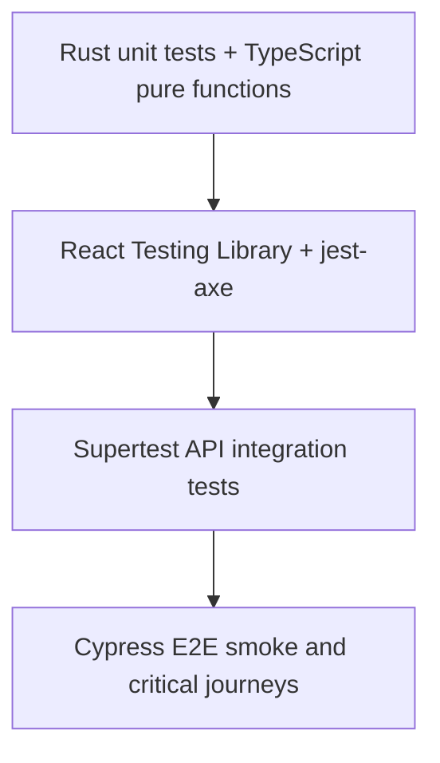

# Testing Architecture

## Test Pyramid



## Commands

```bash
npm run lint
npm run typecheck
npm run test:coverage
cargo test --manifest-path services/carbon-core/Cargo.toml
npm run build
```

## Coverage Strategy

- Calculator, dashboard, coach, twin, maps, and accessibility controls receive component tests.
- API tests cover validation, security headers, carbon calculation, AI fallback, OCR inference, and Maps fallback.
- Rust tests cover deterministic calculation, validation, and scenario generation.
- Cypress covers high-value user journeys.
- CI runs lint, typecheck, tests, audit, build, and Cypress smoke.

## Expansion To 95%+

- Add contract tests for every OpenAPI route.
- Add Firestore emulator integration tests.
- Mock Gemini, Vertex AI, Vision, and Maps with deterministic fixtures.
- Add Lighthouse CI budgets for performance, accessibility, best practices, and SEO.
